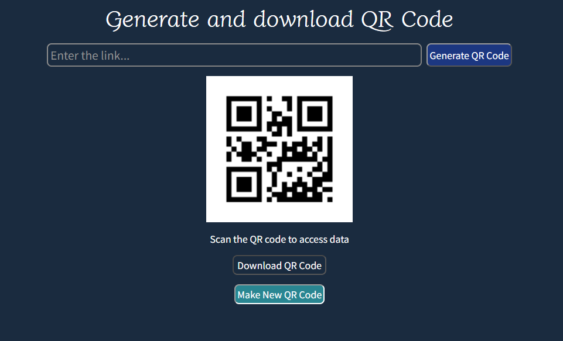

## QR Code Generator 

Experience seamless QR code creation with our React and Node.js QR Code Generator. Crafted for simplicity, this tool allows you to generate QR codes for any link effortlessly. Download your personalized QR code instantly, making it a versatile solution for integrating dynamic links into your projects, documents, or promotional material.

### Hosted Link : https://pine-qr-generator.netlify.app
 

### Features:
- User can generate QR code for any link.
- User can dowload the QR code

## Backend 
- The backend part is in the server file.
- The server API is built on NodeJS.
- The server API is deployed on Render.

### Libraries Used:
- cors
- express
- nodemon
- qrcode

## Frontend
- The frontend part is in the client file.
- The client side is built on React.
- The frontend is deployed on Netlify.

### Libraries Used:
- axios

## How to setup the project on local system
- Clone this project to your local system.
- For client and server files individually follow the bellow steps.
- Run `npm install` to install required dependencies.
- Run `npm start` to start the app.
- The client app will be live on [http://localhost:3000](http://localhost:3000).
- The server app will be live on [http://localhost:5000](http://localhost:5000).
